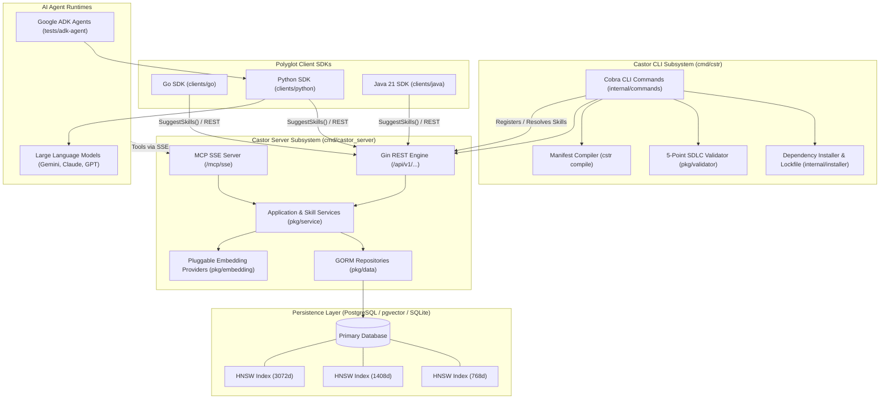

# System Specification: 02. Architecture & Subsystems

## 1. High-Level Architecture (C4 Component Model)

The Castor platform comprises five interconnected core subsystems:

---

## 2. Subsystem Breakdown

### 2.1 Central Registry Server (`cmd/castor_server`)
* **Framework**: Built on Go 1.26.5 using the Gin Web Framework.
* **Dual Interface**:
  - **REST API (`/api/v1`)**: Handles skill registration, metadata queries, application lifecycle, developer authentication, and collaborator RBAC.
  - **MCP SSE Server (`/mcp/sse`)**: Implements Model Context Protocol over Server-Sent Events, enabling MCP-compliant AI agents (e.g., Claude Desktop, Antigravity, custom ADK runtimes) to inspect and execute tools.
* **Bounded Pagination**: Enforces hard request parameter validation ($1 \le \text{page\_size} \le 25$) with standard pagination headers (`X-Total-Count`, `X-Page`, `X-Page-Size`, `X-Total-Pages`).
* **Embeddings & Vector Indexing**:
  - Automatically decomposes registered skills into multi-chunk text and asset slices.
  - Generates dense vector embeddings using pluggable providers:
    - **Vertex AI**: `text-embedding-004` (768d) and `multimodalembedding` (1408d).
    - **AlloyDB AI**: In-database embedding model (`alloydb-ai`, 768d).
    - **Deterministic Mock**: Normalized SHA-256 hash generator for hermetic testing and offline operation.

### 2.2 CLI Package Manager (`cmd/cstr`)
* **Role**: Standalone, hermetically built command-line tool for developers and CI/CD pipelines.
* **Key Capabilities**:
  - `search` / `list`: Query remote registry or local skills with pagination.
  - `add`: Fetch and install skills across polyglot URI schemes (`castor://`, `github://`, `mod://`, `maven://`, `pkg://`, `file://`).
  - `register`: Publish source skills to the central server with vector embedding computation.
  - `validate`: Execute the 5-point SDLC compliance audit.
  - `verify`: Check installed skill directory checksums against `.manifest.lock`.
  - `compile`: Generate zero-I/O pre-compiled `skills_manifest.json` for rapid agent cold starts.
  - `init`: Scaffold a standards-compliant skill directory structure.

### 2.3 Polyglot Client SDKs
* **Go SDK (`clients/go/pkg/castor_client`)**:
  - Package `castor_client` with `SkillRegistry` and `SuggestSkills()`.
  - Supports `//go:generate cstr compile` and `//go:embed` for embedding compiled manifests directly into Go binaries.
* **Python SDK (`clients/python`)**:
  - Native Python 3.13 client providing dynamic JIT pre-call skill suggestion.
  - Implements a PEP 517 build backend (`build-backend = "castor_client.build_meta"`) to download and validate skills during package build.
  - Direct integration with the Google Agent Development Kit (ADK).
* **Java SDK (`clients/java`)**:
  - Java 21 enterprise client compiled with `--release 17` for broad runtime compatibility.
  - Features virtual threads and structured concurrency for high-throughput skill queries.
  - Maven Mojo plugin for generating and embedding skills into executable JARs during build.

### 2.4 Model-Driven Development (MDD) via Protocol Buffers (`proto/castor/`)
* Canonical schemas serve as the single source of truth:
  - `proto/castor/skills/v1/`: Skill manifests, tool definitions, execution hints, and vector bindings.
  - `proto/castor/registration/v1/`: Application registrations, API keys, developer identity, and access scopes.
* Compiled hermetically to Go, Python, and Java using `rules_proto`.

### 2.5 Hermetic Build Infrastructure (Bazel 8 Bzlmod)
* Canonical build orchestrator using `MODULE.bazel`.
* Manages multi-language toolchains hermetically without reliance on ambient host package managers (`make`, `uv`, `mvn`, `pip`, host `go`).
