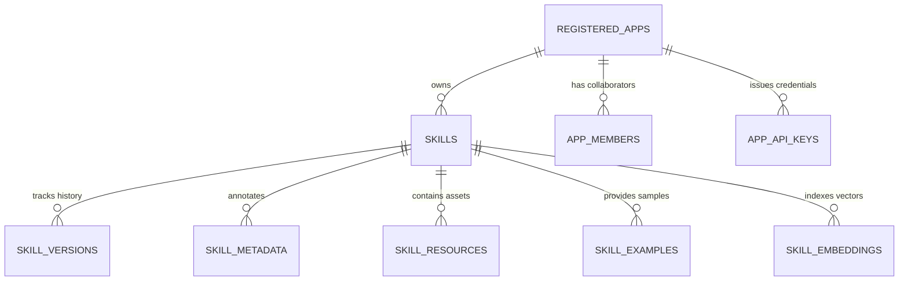

# System Specification: 06. Persistence & Data Models

## 1. Storage Architecture Overview

The Castor persistence layer uses **GORM** over relational and vector storage engines:
* **Production**: PostgreSQL 16+ or Google Cloud AlloyDB with the `pgvector` extension enabled.
* **Development / Embedded**: Pure Go SQLite (`modernc.org/sqlite`) for zero-dependency local testing.

---

## 2. Entity-Relationship Model (ERD)



---

## 3. Relational Table Schemas

### 3.1 `skills` Table
Primary registry entity representing an agent skill.
* `id` (VARCHAR, PK): Unique skill identifier (e.g. `sk-9b1deb4d`).
* `app_id` (VARCHAR, FK): Owning application identifier.
* `category` (VARCHAR, Nullable): Domain classification (e.g., `python`, `devops`, `database`).
* `name` (VARCHAR): Skill name in kebab-case.
* `uri` (VARCHAR): Canonical Castor URI (`castor://skills/{domain}/{category}/{name}/{version}`).
* `latest_version` (VARCHAR): Current semantic version string (default `'1.0.0'`).
* `source_uri` (VARCHAR): Original installation source URI.
* `description` (TEXT): Single-line summary of capabilities.
* `instructions` (TEXT): Complete markdown prompt and execution rules.
* `license` (VARCHAR, Nullable): SPDX license identifier.
* `author` (VARCHAR, Nullable): Primary author attribution.
* `sha256_hash` (VARCHAR): Cryptographic hash of the skill bundle.
* `hitl_tier` (VARCHAR): Security tier (`TIER_1_AUTO_READ`, `TIER_3_MANDATORY_APPROVAL`, etc.).
* `tags_json` (TEXT): Serialized JSON array of discovery keywords.
* `trigger_phrases_json` (TEXT): Serialized JSON array of intent triggers.
* `created_at` / `updated_at` (TIMESTAMP WITH TIME ZONE): Audit timestamps.

### 3.2 `skill_versions` Table
Historical version registry enabling immutable version pinning.
* `id` (VARCHAR, PK): Version record ID.
* `skill_id` (VARCHAR, FK): References `skills.id`.
* `version` (VARCHAR): Semantic version string.
* `uri` (VARCHAR): Versioned canonical URI.
* `json_schema_json` (TEXT): Generated JSON Schema for skill tool execution.
* `sha256_hash` (VARCHAR): Cryptographic hash of this specific version.
* `created_at` (TIMESTAMP WITH TIME ZONE): Ingestion timestamp.

### 3.3 `skill_embeddings` Table
Multi-modal vector storage supporting dense semantic retrieval.
* `id` (VARCHAR, PK): Embedding record ID.
* `skill_id` (VARCHAR, FK): References `skills.id`.
* `target_type` (VARCHAR): Chunk classification (`skill`, `reference`, `example`, `script`).
* `target_name` (VARCHAR): File or section pointer (e.g., `references/canvas.png`).
* `embedding_json` (TEXT): JSON representation of vector floats (fallback).
* `embedding_768` (vector(768)): Dense vector for 768-dimensional models (`text-embedding-004`, `alloydb-ai`).
* `embedding_1408` (vector(1408)): Dense vector for 1408-dimensional multi-modal models (`multimodalembedding`).
* `embedding_3072` (vector(3072)): Dense vector reserved for 3072-dimensional high-fidelity models.
* `model_name` (VARCHAR): Model generating the vector.
* `dimension` (INT): Vector length.
* `created_at` (TIMESTAMP WITH TIME ZONE): Ingestion timestamp.

### 3.4 `registered_apps` Table
Tenant authority governing skill ownership and domain namespaces.
* `app_id` (VARCHAR, PK): Application identifier.
* `app_name` (VARCHAR): Human-readable name.
* `domain` (VARCHAR): Verified corporate domain authority (e.g. `retailcortex.com`).
* `app_urn` (VARCHAR, Unique): Canonical RFC 8141 URN (`urn:castor:app:<domain>:<app_name>`).
* `organization_id` (VARCHAR, Nullable): Optional enterprise organization ID.
* `email` (VARCHAR): Primary administrative contact.
* `domain_verification_status` (VARCHAR): Verification state (`VERIFIED_SSO`, `VERIFIED_DNS`, `PENDING_DNS`, `REJECTED`).
* `dns_txt_challenge` (VARCHAR, Nullable): Verification challenge token.
* `api_key_hash` (VARCHAR): SHA-256 hash of root API key.
* `is_active` (BOOLEAN): Soft-delete or activation flag.
* `verification_token` (VARCHAR): Registration verification token.
* `created_at` / `verified_at` (TIMESTAMP WITH TIME ZONE): Ingestion and verification timestamps.

### 3.5 `app_members` Table
Role-Based Access Control (RBAC) collaborator records.
* `id` (VARCHAR, PK): Member ID.
* `app_id` (VARCHAR, FK): References `registered_apps.app_id`.
* `email` (VARCHAR): Member email.
* `role` (VARCHAR): Permission level (`OWNER`, `EDITOR`, `VIEWER`).
* `invited_by` (VARCHAR): Inviting user's email.
* `status` (VARCHAR): Member state (`ACTIVE`, `PENDING_INVITE`, `REVOKED`).
* `invitation_token` (VARCHAR): Secret token for accepting invitations.
* `name`, `family_name`, `given_name`, `preferred_username`, `picture` (VARCHAR): OIDC profile claims.
* `oauth_sub` (VARCHAR): OpenID Connect subject identifier.
* `created_at` / `accepted_at` (TIMESTAMP WITH TIME ZONE): Membership timestamps.

### 3.6 `app_api_keys` Table
Scoped API authentication credentials.
* `id` (VARCHAR, PK): Key ID.
* `app_id` (VARCHAR, FK): References `registered_apps.app_id`.
* `key_hash` (VARCHAR): Secure hash of the API key secret.
* `prefix` (VARCHAR): Public prefix for identification (e.g., `cstr_live_...`).
* `name` (VARCHAR): Descriptive key name (e.g., `ci-cd-deploy-key`).
* `scopes_json` (TEXT): Serialized array of permission scopes.
* `created_by` (VARCHAR): Creator identity.
* `expires_at` (TIMESTAMP WITH TIME ZONE, Nullable): Expiration time.
* `revoked_at` (TIMESTAMP WITH TIME ZONE, Nullable): Revocation timestamp.
* `created_at` (TIMESTAMP WITH TIME ZONE): Creation timestamp.

---

## 4. Vector Indexes (PostgreSQL / AlloyDB `pgvector`)

All active vector columns MUST be accelerated using Hierarchical Navigable Small World (HNSW) indexes with cosine distance:

```sql
CREATE INDEX IF NOT EXISTS skills_embedding_768_hnsw_idx 
ON skill_embeddings USING hnsw (embedding_768 vector_cosine_ops)
WITH (m = 16, ef_construction = 64);

CREATE INDEX IF NOT EXISTS skills_embedding_1408_hnsw_idx 
ON skill_embeddings USING hnsw (embedding_1408 vector_cosine_ops)
WITH (m = 16, ef_construction = 64);
```

---

## 5. File-Based Persistence Specifications

### 5.1 Cryptographic Lockfile (`.manifest.lock`)
Stored in the root of any directory containing installed skills (e.g. `.skills/.manifest.lock`):

```json
{
  "version": "1.0.0",
  "generated_at": "2026-09-04T22:00:00Z",
  "skills": {
    "python-adk-fastapi": {
      "source_uri": "castor://skills/retailcortex.com/python/python-adk-fastapi/1.0.0",
      "installed_path": "skills/python-adk-fastapi",
      "sha256": "4f53cda18c2baa0c0354bb5f9a3ecbe5ed12ab4d8e11ba873c2f11161202b945",
      "files": {
        "SKILL.md": "a3f890123...",
        "references/api.md": "b47c89124...",
        "examples/server.py": "c56d78235..."
      }
    }
  }
}
```

### 5.2 Pre-Compiled Manifest (`skills_manifest.json`)
Generated via `cstr compile` for zero-I/O agent startup:

```json
{
  "version": "1.0.0",
  "compiled_at": "2026-09-04T22:00:00Z",
  "skills": [
    {
      "name": "python-adk-fastapi",
      "description": "FastAPI service generator for Google ADK",
      "version": "1.0.0",
      "instructions": "System prompt text...",
      "hitl_tier": "TIER_2_AUDITED_WRITE",
      "trigger_phrases": ["build fastapi agent", "scaffold adk api"],
      "tools": [
        {
          "name": "create_endpoint",
          "description": "Generates a route handler",
          "parameters": { ... }
        }
      ]
    }
  ]
}
```
