# System Specification: 09. User Interface & Skill Authoring Studio

## 1. Executive Summary & UI Mission

The **Castor User Interface (Castor Web & Desktop Studio)** serves as the visual control plane, governance hub, and authoring environment for the Castor platform. It connects directly to the central **Castor Registry Server** (`cmd/castor_server`) via dual communication interfaces:
1. **Gin REST API (`/api/v1`)**: Powers user profile management, multi-tenant workspace/group administration, RBAC collaborator permissions, scoped API keys, and skill catalog querying/registration.
2. **Model Context Protocol (MCP) Server-Sent Events (`/mcp/sse`)**: Powers the **AI-Assisted Skill Architect Agent**, providing bidirectional tool discovery, inspection, and autonomous skill generation workflows.

### 1.1 Core Principles & Modern Technology Stack
* **Framework**: Built on **React 19** with a high-performance Single Page Application (SPA) architecture (Vite / Next.js app directory) and TypeScript 5.5+.
* **Design Standard**: Fully adheres to the **Google Material Design 3 (Material You / M3) Specification**, adapted for high-density developer consoles through an **Ultra-Modern Dark Glassmorphic Design System**:
  - **M3 Dynamic Color System**: Implements M3 tonal color roles (`primary`, `on-primary`, `surface-container`, `outline-variant`, `tertiary`) rendered with translucent frosted glass (`backdrop-blur-2xl`, `bg-surface-container/70`).
  - **M3 Elevation via Glassmorphism**: Traditional drop shadows are augmented with alpha-channel surface elevation, subtle neon specular edge borders (`border-outline-variant/30`), and ambient radial glows.
  - **M3 Shape Scale**: Strict adherence to M3 corner radius tokens: Extra Small (4px), Small (8px), Medium (12px), Large (16px), Extra Large (28px), and Full Pill (9999px).
  - **M3 State Layers**: Semi-transparent overlays for hover (8%), focus (12%), and pressed (12%) states.
* **Iconography**: Standardized exclusively on **Google Material Symbols (Rounded style)** with variable optical sizing, fill states, and official glyph identifiers.
* **Mandatory OAuth 2.0 / OIDC Authentication**:
  - **OAuth 2.0 with PKCE is strictly required** for all logins. Direct unauthenticated access is disabled.
  - Seamless enterprise Single Sign-On (SSO) integration (Google Workspace, Okta, Microsoft Entra ID, Keycloak).
  - Automated corporate domain verification with immediate rejection of consumer freemail providers.
* **Comprehensive User Profile Management**:
  - Full self-service profile dashboard allowing users to view and manage claims, avatar, preferred usernames, active group/workspace memberships, roles, and personal API session tokens.
* **Intuitive & Frictionless Developer UX**:
  - M3 Search Bar & docked Search View with `Cmd+K` global command palette.
  - M3 Filter Chips and Assist Chips for rapid faceted filtering.
  - Conversational AI Skill Architect Studio featuring M3 Extended FABs, streaming LLM dialogue, and one-click registration.

---

## 2. High-Level Architecture & Interaction Model

```mermaid
graph TD
    subgraph Client ["Castor UI Frontend (React 19 + Tailwind CSS + Material 3)"]
        AUTH_GATE["Mandatory OAuth 2.0 / OIDC Gate"]
        SESSION["Session & Token Store (HTTP-Only / In-Memory PKCE)"]
        M3_SEARCH["M3 Search Bar & View (Cmd+K)"]
        
        subgraph Shell ["M3 Dark Glassmorphic Shell"]
            TOP_BAR["M3 Top App Bar & Workspace Switcher"]
            NAV_RAIL["M3 Navigation Rail (Rail / Drawer)"]
            PROFILE_SHEET["User Profile Modal / Sheet"]
            
            subgraph Views ["Core Application Modules"]
                PROFILE_VIEW["User Profile Management (/profile)"]
                GROUP_VIEW["Group & Workspace Admin (/workspaces)"]
                SEARCH_VIEW["Skill Discovery & Semantic Search (/skills)"]
                DETAIL_VIEW["Skill Inspector & Asset Explorer (/skills/:id)"]
                MANUAL_STUDIO["Manual Authoring Studio (/studio/manual)"]
                AGENT_STUDIO["AI Skill Architect Studio (/studio/agent)"]
            end
            
            LINTER["Real-Time 5-Point SDLC Linter"]
        end
    end

    subgraph Server ["Castor Server Subsystem (cmd/castor_server)"]
        REST_API["Gin REST API (/api/v1)"]
        MCP_SSE["MCP SSE Gateway (/mcp/sse)"]
        AGENT_STREAM["Agent Streaming Endpoint (/api/v1/agent/stream)"]
    end

    subgraph IdP ["Enterprise Identity Provider"]
        OIDC_AUTH["OIDC Provider (Google / Okta / Azure AD)"]
    end

    subgraph Storage ["Persistence Layer"]
        PG_DB[(PostgreSQL / AlloyDB)]
        PG_VEC["pgvector HNSW Vector Indexes"]
    end

    AUTH_GATE -- "OAuth 2.0 PKCE Challenge" --> OIDC_AUTH
    OIDC_AUTH -- "ID Token & User Claims" --> SESSION
    SESSION -- "Bearer Token (Authorization: Bearer ...)" --> REST_API

    PROFILE_VIEW -- "GET /api/v1/user/profile" --> REST_API
    GROUP_VIEW -- "GET/POST /api/v1/apps/members, /keys" --> REST_API
    SEARCH_VIEW -- "GET /api/v1/skills?q=..." --> REST_API
    DETAIL_VIEW -- "GET /api/v1/skills/:id" --> REST_API
    MANUAL_STUDIO -- "POST/PUT /api/v1/skills" --> REST_API

    AGENT_STUDIO -- "Tool Execution (search, get, register)" --> MCP_SSE
    AGENT_STUDIO -- "SSE Token Stream" --> AGENT_STREAM
    MCP_SSE -- "Registry Query / Mutate" --> REST_API

    REST_API --> PG_DB
    REST_API --> PG_VEC
```



---

## 3. Material Design 3 (M3) Dark Glassmorphic Design System

The visual design system combines Google's Material Design 3 foundation with frosted dark glassmorphism.

### 3.1 M3 Dynamic Color Tokens in Dark Mode
The theme uses a primary cyan/teal tonal palette balanced with deep obsidian surfaces and violet/amber accents:

| M3 Token Name | Hex Value | Tailwind Utility Class | Usage Description |
| :--- | :--- | :--- | :--- |
| `md-sys-color-primary` | `#4DD0E1` | `text-cyan-300`, `bg-cyan-400` | Primary brand accent, key highlights, active icons. |
| `md-sys-color-on-primary` | `#00363D` | `text-cyan-950` | Text/icons rendered on top of solid primary elements. |
| `md-sys-color-primary-container` | `#004F58` | `bg-cyan-950/70 border-cyan-500/30` | Translucent glass container for primary action targets. |
| `md-sys-color-on-primary-container` | `#A6EEF8` | `text-cyan-200` | Text/icons inside primary containers. |
| `md-sys-color-surface` | `#0B0F17` | `bg-slate-950` | Baseline dark canvas background. |
| `md-sys-color-surface-dim` | `#070A0F` | `bg-slate-950/90` | Recessed surfaces, code blocks, terminal backgrounds. |
| `md-sys-color-surface-container-low` | `#111827` | `bg-slate-900/40 backdrop-blur-md` | Lowest elevated glass cards. |
| `md-sys-color-surface-container` | `#161F30` | `bg-slate-900/60 backdrop-blur-xl` | Standard elevated glass panel for cards and modals. |
| `md-sys-color-surface-container-high` | `#1E293B` | `bg-slate-800/60 backdrop-blur-2xl` | Floating toolbars, search bars, and dropdown menus. |
| `md-sys-color-surface-container-highest` | `#26334D` | `bg-slate-700/60 backdrop-blur-2xl` | Active tabs, selected list items, focused inputs. |
| `md-sys-color-outline` | `#64748B` | `border-slate-500/30` | Prominent division lines and unselected card borders. |
| `md-sys-color-outline-variant` | `#334155` | `border-white/10` | Subtle frosted glass specular borders. |
| `md-sys-color-tertiary` | `#D8B4FE` | `text-purple-300` | AI Agent presence, autonomous synthesis highlights. |
| `md-sys-color-tertiary-container` | `#3B1D54` | `bg-purple-950/60 border-purple-500/30` | Glass container for AI Agent chips and status badges. |
| `md-sys-color-error` | `#F87171` | `text-rose-400` | Error banners, deletion actions, CWE violations. |

### 3.2 M3 Shape Tokens & Corner Radius Scale
The UI adheres strictly to M3 corner curvature rules:
* **None (`rounded-none`)**: Full-bleed code editors and status bar dividers.
* **Extra Small (`rounded-xs` / 4px)**: Syntax tokens, inline code snippets.
* **Small (`rounded-sm` / 8px)**: Tooltips, table cell pills, drop-down items.
* **Medium (`rounded-md` / 12px)**: Form input fields, buttons, filter chips.
* **Large (`rounded-lg` / 16px)**: Skill cards, inspector preview blocks.
* **Extra Large (`rounded-[28px]`)**: Modals, dialogs, floating action sheets.
* **Full Pill (`rounded-full`)**: M3 Search Bar, status badges, avatars, and Floating Action Buttons (FABs).

### 3.3 M3 State Layers & Tactile Micro-Interactions
* **Hover State**: `hover:bg-white/[0.06] transition-colors duration-150`.
* **Focus State**: Focused controls show an M3 outline with a soft neon glow: `focus:outline-none focus:ring-2 focus:ring-cyan-400/50 focus:border-cyan-400`.
* **Active / Pressed State**: `active:scale-[0.98] transition-transform duration-100`.

---

## 4. Google Material Symbols Standard (Iconography)

All icons throughout the application strictly use **Google Material Symbols (Rounded)**. Below is the authoritative glyph mapping used across components:

| Category | UI Context | Material Symbols Glyph Name | Icon Token |
| :--- | :--- | :--- | :--- |
| **Navigation & App Bar** | Global search omnibar | `search` | `<span class="material-symbols-rounded">search</span>` |
| | Workspace / Group switcher | `corporate_fare` | `corporate_fare` |
| | Navigation rail items | `dashboard`, `extension`, `smart_toy`, `settings` | Standard M3 rail glyphs |
| | Close / Dismiss | `close` | `close` |
| | Expand / Collapse | `expand_more`, `expand_less` | Dropdown indicators |
| **Identity & Profile** | User avatar fallback | `account_circle` | `account_circle` |
| | OAuth / SSO Sign-In | `fingerprint`, `lock`, `vpn_key` | Security & auth badges |
| | Verified domain badge | `verified` | Verification shield |
| | Role badges | `admin_panel_settings` (Owner), `edit` (Editor), `visibility` (Viewer) | RBAC indicator icons |
| | Logout / Revoke | `logout` | Session termination |
| **Skills & Discovery** | Skill item / package | `extension` | Package symbol |
| | HITL Tier 1 (Auto-Read) | `visibility` | Read-only clearance |
| | HITL Tier 2 (Audited Write) | `edit_note` | Audited mutation clearance |
| | HITL Tier 3 (Human Approval) | `shield` | Security approval gate |
| | Copy canonical URI | `content_copy` | Clipboard copy |
| | Version history | `history` | Version timeline |
| | Code / Tools definition | `terminal`, `code`, `data_object` | Tool & schema views |
| | Reference documentation | `description`, `menu_book` | Documentation tree |
| **SDLC Invariants** | 5-point pass state | `check_circle` | Green verification check |
| | Invariant failure | `cancel`, `error` | Red violation alert |
| | CWE Security audit | `security` | CWE vulnerability guard |
| | Rate limit 429 resilience | `bolt` | Resilience check |
| | Clickable link validity | `link` | Markdown file link check |
| **AI Agent Studio** | AI Skill Architect copilot | `auto_awesome` | AI spark icon |
| | Autonomous reasoning trace | `psychology` | Reasoning loop |
| | Tool execution event | `play_arrow` | Tool call execution |
| | Live diff review | `compare_arrows` | Version diff |
| | Send instruction prompt | `send` | Chat submit |

---

## 5. Mandatory OAuth 2.0 Authentication & Login View

Anonymous access and unauthenticated usage are strictly forbidden. All access to Castor UI routes is gated behind an M3 dark glassmorphic OAuth login card.

```
+----------------------------------------------------------------------------------------------------+
|                                                                                                    |
|                                       [ CASTOR PLATFORM ]                                          |
|                                Enterprise Agent Skills Registry                                    |
|                                                                                                    |
|                 +----------------------------------------------------------------+                 |
|                 |          [ M3 Extra-Large Glass Card (rounded-[28px]) ]         |                 |
|                 |                                                                |                 |
|                 |    (lock)  Sign in to Castor Platform                          |                 |
|                 |            Enterprise Single Sign-On (OAuth 2.0 / OIDC)        |                 |
|                 |                                                                |                 |
|                 |    +------------------------------------------------------+    |                 |
|                 |    | [G]  Continue with Google Workspace                  |    |                 |
|                 |    +------------------------------------------------------+    |                 |
|                 |    | [O]  Continue with Okta Enterprise SSO               |    |                 |
|                 |    +------------------------------------------------------+    |                 |
|                 |    | [M]  Continue with Microsoft Entra ID                |    |                 |
|                 |    +------------------------------------------------------+    |                 |
|                 |                                                                |                 |
|                 |    (info) Access is restricted to verified enterprise domain   |                 |
|                 |           accounts. Public freemail addresses are prohibited.  |                 |
|                 +----------------------------------------------------------------+                 |
|                                                                                                    |
+----------------------------------------------------------------------------------------------------+
```

### 5.1 OAuth Invariants & Security
1. **OAuth 2.0 Authorization Code with PKCE (RFC 7636)**:
   - Initiates cryptographically bound authentication requesting standard OIDC scopes (`openid`, `profile`, `email`).
   - Securely receives and stores ID tokens and refresh tokens in memory or SameSite HTTP-only cookies.
2. **Corporate Domain Matching & Freemail Rejection**:
   - Compares the authenticated email domain with `registered_apps.domain`.
   - Explicitly rejects consumer email providers (`gmail.com`, `yahoo.com`, etc.) with an M3 error container (`bg-rose-950/50 border border-rose-500/30 text-rose-300`).
3. **Session Heartbeat**:
   - Proactively rotates access tokens via refresh tokens.
   - Upon session expiry, renders a frosted M3 Snackbar notification before cleanly redirecting to the login gate.

---

## 6. User Profile Management (`/profile`)

The User Profile view provides comprehensive management of the user's authenticated identity, team roles, and active credentials.

```
+----------------------------------------------------------------------------------------------------+
|  [corporate_fare] Workspace: [Retail Cortex Prod v]      [(search) Search Skills (Cmd+K)]  (account)|
+----------------------------------------------------------------------------------------------------+
|  USER PROFILE & ACCOUNT GOVERNANCE                                                                 |
|                                                                                                    |
|  +-----------------------------------------------+  +--------------------------------------------+ |
|  | (badge) Identity & Verified OIDC Claims       |  | (group) Workspace Memberships & Roles      | |
|  |                                               |  |                                            | |
|  | [(account) Ryan M.]  Ryan McGuinness          |  | Retail Cortex Production  [OWNER]  Active  | |
|  |                      Principal AI Architect   |  | urn:castor:app:retailcortex.com:prod       | |
|  |                                               |  |                                            | |
|  | Email:       ryan@retailcortex.com (verified) |  | Gemini ADK Labs           [EDITOR] Active  | |
|  | Domain:      retailcortex.com                 |  | urn:castor:app:retailcortex.com:adk-labs   | |
|  | Preferred:   @ryan                            |  |                                            | |
|  | Subject ID:  sub_98a7df823a10                 |  | Security Sandbox          [VIEWER] Active  | |
|  | Provider:    Google Workspace OIDC            |  | urn:castor:app:retailcortex.com:sandbox    | |
|  +-----------------------------------------------+  +--------------------------------------------+ |
|                                                                                                    |
|  +-----------------------------------------------+  +--------------------------------------------+ |
|  | (tune) UI Appearance & Developer Preferences  |  | (vpn_key) Active Sessions & CLI Tokens     | |
|  |                                               |  |                                            | |
|  | Theme:       (*) Obsidian Dark                |  | MacBook Pro (Current)     Active Now       | |
|  |              ( ) OLED Black                   |  | Chrome macOS • Session JWT                 | |
|  |              ( ) Cyberpunk Glass              |  |                                            | |
|  | Code Font:   [ JetBrains Mono              v] |  | CLI Key (cstr)            Active (2d ago)  | |
|  | Keymap:      [ Standard (Monaco)           v] |  | cstr_live_8f0a... • Expires in 28 days     | |
|  |                                               |  |                                            | |
|  | [ Save Changes ]                              |  | [ (logout) Revoke All Other Sessions ]     | |
|  +-----------------------------------------------+  +--------------------------------------------+ |
+----------------------------------------------------------------------------------------------------+
```

### 6.1 Profile Subsystems
* **OIDC Claim Display & Handle Alias**:
  - Displays authenticated claims (`name`, `given_name`, `family_name`, `email`, `picture`, `oauth_sub`).
  - Allows the user to configure a localized display alias (`preferred_username`) without mutating corporate directory records.
* **Workspace Membership Audit**:
  - Lists all application teams the user belongs to (`app_members`) with their assigned role (`OWNER`, `EDITOR`, `VIEWER`).
  - Provides a 1-click "Switch to Workspace" action button.
* **Session & CLI Credential Governance**:
  - Lists active browser sessions and issued CLI tokens.
  - "Revoke All Other Sessions" button triggers an immediate revocation call to `/api/v1/apps/keys` and session store cleanup.
* **M3 Theme Preferences**:
  - Toggles between M3 dark surface tones (Obsidian, OLED Black, Cyberpunk Neon).

---

## 7. Group & Team (Workspace) Management

The Workspace Management view (`/workspaces`) manages enterprise collaborator access and application settings in compliance with **FR-1** and **FR-7**.

### 7.1 M3 Collaborator Table & Member Invitation
* **Members Table (`GET /api/v1/apps/members`)**:
  - Outlined glass card containing user avatars, email address, role chip (`OWNER`, `EDITOR`, `VIEWER`), status pill (`ACTIVE`, `PENDING_INVITE`), and action menu.
* **M3 Invite Collaborator Dialog (`POST /api/v1/apps/members/invite`)**:
  - Translucent modal (`rounded-[28px]`) with Material Symbols header: `group_add`.
  - Input fields for collaborator email and role selector dropdown.
  - Generates a shareable invitation link containing the secret invitation token.
* **Role Elevation & Deprovisioning**:
  - Role modifications invoke `PATCH /api/v1/apps/members/:id`.
  - Member revocations invoke `DELETE /api/v1/apps/members/:id` with destructive confirmation styling.

### 7.2 Scoped API Key Governance (`/api/v1/apps/keys`)
* **Automation Key Management**:
  - Lists scoped automation keys used by autonomous agents and CI/CD pipelines.
  - Displays Key Name, Key Prefix (`cstr_live_...`), Role Scope, Expiration, and Revocation action.
* **Provisioning Dialog**:
  - Modal collecting Key Name, Scope (`EDITOR` or `VIEWER`), and Expiration (30/60/90 days or never).
  - One-time presentation of secret API key with one-click copy icon (`content_copy`) and automated snippet generator for `~/.castor/.env.toml`.

---

## 8. Skill Discovery & Semantic Search

The Skill Discovery Hub combines Google's Material 3 Search Bar pattern with `pgvector` HNSW semantic retrieval.

```
+----------------------------------------------------------------------------------------------------+
|  [corporate_fare] Workspace: [Retail Cortex Prod v]      [(search) Search Skills (Cmd+K)]  (account)|
+----------------------------------------------------------------------------------------------------+
|  FILTERS (M3 Filter Chips) | SKILLS CATALOG (Showing 1-10 of 42 Skills)         Sort: [Semantic v] |
|                            |-----------------------------------------------------------------------|
|  Category:                 | +-------------------------------------------------------------------+ |
|  [(check) Python        ]  | | [extension] python-adk-fastapi             v1.2.0 [edit_note TIER2] | |
|  [ DevOps               ]  | | FastAPI service generator for Google ADK agents with async routes | |
|  [ Database             ]  | | and Pydantic schema validation.                                   | |
|  [ Security             ]  | | URI: castor://skills/retailcortex.com/python/python-adk-fastapi   | |
|                            | | (tag) [google-adk] [fastapi]                      Author: @ryan   | |
|  Scope:                    | +-------------------------------------------------------------------+ |
|  (*) Team Workspace        | +-------------------------------------------------------------------+ |
|  ( ) All Enterprise        | | [extension] bigquery-sales-forecaster      v2.0.1 [visibility T1]   | |
|  ( ) Personal Drafts       | | Autonomous BigQuery SQL anomaly detection and sales forecast.     | |
|                            | | URI: castor://skills/retailcortex.com/database/bigquery-forecaster| |
|  HITL Security Tier:       | | (tag) [bigquery] [analytics]                     Author: @sarah  | |
|  [ (visibility) Tier 1  ]  | +-------------------------------------------------------------------+ |
|  [ (edit_note) Tier 2   ]  | +-------------------------------------------------------------------+ |
|  [ (shield) Tier 3      ]  | | [extension] k8s-canary-rollout             v1.0.0 [shield TIER 3]   | |
|                            | | Kubernetes automated canary rollout and metric health checks.     | |
|  Bounded Pagination:       | | URI: castor://skills/retailcortex.com/devops/k8s-canary-rollout   | |
|  Page Size: [ 10 v ]       | | (tag) [k8s] [devops]                             Author: @devops | |
|                            | +-------------------------------------------------------------------+ |
|                            |-----------------------------------------------------------------------|
|                            | [ (arrow_back) Prev ] Page 1 of 5 [ Next (arrow_forward) ]  (Total: 42)|
+----------------------------------------------------------------------------------------------------+
```

### 8.1 M3 Search Bar & Filter Chips
* **M3 Pill Search Bar (`rounded-full`)**:
  - Centered search input (`h-12 bg-slate-900/60 backdrop-blur-xl border border-white/10 px-4`).
  - Leading search icon (`search`) and trailing keyboard hint (`Cmd+K`).
  - Live debouncing (300ms) triggering `/api/v1/skills?q=<query>`.
* **M3 Filter Chips (`rounded-lg`)**:
  - Horizontal chip group for rapid category and tier toggling.
  - Selected chips display a leading checkmark icon (`check`) and primary container styling.
* **Bounded Pagination Compliance**:
  - Strictly bound to $1 \le \text{page\_size} \le 25$.
  - Renders pagination controls using response headers (`X-Total-Count`, `X-Page`, `X-Page-Size`, `X-Total-Pages`).

### 8.2 Comprehensive Skill Inspector (`/skills/:id`)
* **M3 Tabs Navigation (`rounded-t-xl`)**:
  - **Instructions Tab (`description`)**: Rendered Markdown with GitHub-style alerts and syntax-highlighted code fences.
  - **Tools & Schemas Tab (`data_object`)**: Interactive schema table with parameter definitions, types, required flags, and a test payload evaluator.
  - **L3 Asset Explorer (`folder_open`)**: Tree browser for `references/` (PDFs, WebP diagrams, API contracts) and `examples/` (polyglot code samples).
  - **Behavioral Scenarios Tab (`science`)**: Behavioral test scenarios (`scenarios/*.md`) with tool execution assertions and similarity thresholds.
  - **Version History Tab (`history`)**: Version timeline with visual diffing and SHA-256 cryptographic verification.
  - **Integration Snippets (`content_copy`)**: One-click code copy for CLI, Python ADK client, Go build hooks, and Maven JARs.

---

## 9. Manual Skill Authoring Studio (`/studio/manual`)

The Manual Authoring Studio offers a split-pane IDE for authoring skills in compliance with Castor standards.

```
+----------------------------------------------------------------------------------------------------+
|  [ (arrow_back) Skills ]  Editing: python-adk-fastapi (v1.2.0)    [check_circle 5/5 PASS]  [Publish] |
+----------------------------------------------------------------------------------------------------+
| METADATA & FRONTMATTER        | INSTRUCTIONS (SKILL.md)                  | PREVIEW & ASSETS        |
|                               |                                          |                         |
| Name: [python-adk-fastapi    ]| 1: ---                                  | # python-adk-fastapi    |
| Category: [python           v]| 2: name: python-adk-fastapi             |                         |
| Version:  [1.2.0            ]| 3: description: FastAPI generator...    | ## Capabilities         |
| License:  [Apache-2.0       v]| 4: hitl_tier: TIER_2_AUDITED_WRITE      | * Generates async routes|
| HITL Tier:[edit_note Tier 2 v]| 5: ---                                  | * Implements Pydantic   |
| Author:   [Ryan McGuinness  ]| 6:                                      |                         |
|                               | 7: # System Instructions                | ## CWE Safeguards       |
| Trigger Phrases:              | 8: You are an autonomous agent...       | > [!IMPORTANT]          |
| [+ "create fastapi agent"   ] | 9: Follow strict typing rules...         | > Sanitize all input... |
| [+ "scaffold rest service"  ] | 10:                                     |                         |
|                               | 11: ## Error Handling & 429 Resilience  | Progressive Assets:     |
| Tags:                         | 12: When encountering HTTP 429, retry   | [references/api.md    ] |
| [fastapi] [adk] [python]      | 13: with exponential backoff...         | [examples/server.py   ] |
|                               |                                          | [+ Upload Reference   ] |
+----------------------------------------------------------------------------------------------------+
| SDLC LINTER: (check) Frontmatter  (check) L3 Tree  (check) CWE  (check) 429 Backoff  (check) Links |
+----------------------------------------------------------------------------------------------------+
```

### 9.1 Real-Time 5-Point SDLC Quality Invariant Linter
A persistent footer bar displays live M3 status chips for the 5 validation invariants from `pkg/validator`:
1. **Frontmatter Invariant (`check_circle` / `cancel`)**: Validates YAML structure and required attributes.
2. **L3 Directory Tree Invariant**: Confirms presence of non-empty `references/` and `examples/` directories.
3. **CWE Security Invariant**: Flags unconstrained system execution and dangerous shell invocations.
4. **HTTP 429 Resilience Invariant**: Verifies explicit backoff and retry guidance.
5. **Clickable Links Invariant**: Confirms valid `file:///` and relative workspace markdown links.

*The "Publish Skill" button (`bg-gradient-to-r from-cyan-500 to-blue-600`) remains disabled until all 5 chips show `check_circle`.*

---

## 10. AI-Assisted Skill Creation with Autonomous Agent (`/studio/agent`)

The **AI Skill Architect Studio** allows developers to generate complete, production-ready skills through conversational dialogue with an autonomous Google ADK / Gemini agent.

```
+----------------------------------------------------------------------------------------------------+
|  [(arrow_back)] AI Skill Architect: "BigQuery Sales Forecaster"  [check_circle 5/5 PASS] [Publish] |
+----------------------------------------------------------------------------------------------------+
| CONVERSATION & AGENT TRACE          | LIVE SYNTHESIZED ARTIFACT (M3 Tabs)                          |
|                                     |                                                              |
| [User]:                             | [SKILL.md]  [references/bq.md]  [examples/query.py]  [Diff]  |
| "I need an agent skill that queries |--------------------------------------------------------------|
| BigQuery for daily sales anomalies  | ---                                                          |
| and predicts next week's demand."   | name: bigquery-sales-forecaster                              |
|                                     | description: Queries BigQuery sales aggregates and performs  |
| [Agent (auto_awesome)]:             |              anomaly detection and weekly demand forecast.   |
| > (play_arrow) Call: search_skills  | category: database                                           |
|   (Found 2 related skills; avoiding | hitl_tier: TIER_2_AUDITED_WRITE                              |
|    tool bleed by specializing query)| version: 1.0.0                                               |
|                                     | ---                                                          |
| "I have drafted the skill structure.|                                                              |
| Key capabilities include:           | # BigQuery Sales Forecaster                                  |
| 1. Parameterized SQL generator      |                                                              |
| 2. Rate-limit backoff on 429s       | ## Tools & Functions                                         |
| 3. Structured JSON Schema output    | ```json                                                      |
|                                     | {                                                            |
| Would you like to elevate the HITL  |   "name": "query_daily_sales",                               |
| clearance to Tier 3 for mutation?"  |   "parameters": { "dataset": "string", "days": "integer" }   |
|                                     | }                                                            |
| [Prompt Input: Type instruction...] | ```                                                          |
+----------------------------------------------------------------------------------------------------+
| AGENT STATUS: (psychology) Reasoning... Tool: [search_skills: OK] SDLC: [check_circle 5/5 PASS]    |
+----------------------------------------------------------------------------------------------------+
```

### 10.1 Multi-Turn Conversational Authoring Workflow
1. **Natural Language Elicitation**: The user expresses intent in natural language.
2. **MCP Tool Invocations**:
   - `search_skills(query)`: Deduplicates against existing catalog to prevent tool bleed.
   - `get_skill(id)`: Reads reference implementations for structural consistency.
3. **Live Artifact Synthesis**: Streams system instructions, tool JSON Schemas, reference markdown, and executable examples into the split-screen code pane.
4. **Behavioral Scenario Generation**: Automatically drafts a behavioral verification scenario (`scenarios/test_scenario.md`) with test prompts, expected tool calls, and similarity thresholds (**FR-8**).
5. **Interactive Diff & In-Browser Simulation**: The user inspects diffs, simulates scenario executions, and prompts for refinements.
6. **One-Click Registration**: Clicking "Accept & Publish" submits the validated bundle to `/api/v1/skills` under the active team workspace.

---

## 11. Security, Governance & Non-Functional Requirements

### 11.1 Authentication & Session Security (NFR-UI-1)
* **Strict OAuth 2.0 PKCE**: Password-based local login is prohibited. All web client sessions authenticate via standard OIDC PKCE.
* **Token Hardening**: Tokens are stored in secure memory or SameSite HTTP-only cookies with automated refresh rotation.
* **RBAC Route Guards**: Client-side router checks user permissions before rendering routes (`OWNER` required for member/key admin; `EDITOR` for authoring/publishing).

### 11.2 Client-Side Security & Content Sanitization (NFR-UI-2)
* **DOMPurify Sanitization**: All rendered markdown, tool descriptions, and agent outputs are sanitized to prevent Stored XSS attacks.
* **Content Security Policy**: Strict headers disallow inline scripts and unauthorized external frame embedding.

### 11.3 Performance & Latency SLAs (NFR-UI-3)
* **Sub-100ms Interactions**: Filter operations, workspace switches, and route navigations complete in $\le 100\text{ ms}$.
* **Streaming AI Rendering**: Agent tokens stream over SSE with a Time-to-First-Token (TTFT) $\le 800\text{ ms}$ rendered smoothly at $60\text{ fps}$.

---

## 12. Acceptance Criteria & Test Verification

| AC Identifier | System Capability | Requirement | Verification Method |
| :--- | :--- | :--- | :--- |
| **AC-UI-1** | Mandatory OAuth 2.0 PKCE Login | Section 5 | Automated E2E: Unauthenticated access redirects to OIDC provider; code exchange stores token and renders dashboard. |
| **AC-UI-2** | User Profile Management | Section 6 | Browser E2E: User navigates to `/profile`, updates display preferences, and verifies OIDC claims and workspace roles. |
| **AC-UI-3** | Material Design 3 Dark Glassmorphism | Section 3 | Visual Regression: Validates M3 color tokens, elevation layers, and corner radius tokens (`rounded-[28px]`, `rounded-full`). |
| **AC-UI-4** | Google Material Symbols Standard | Section 4 | Automated UI Test: Asserts all action buttons and status chips render valid `material-symbols-rounded` icons. |
| **AC-UI-5** | Workspace & Collaborator Management | Section 7 | E2E Integration: Owner invites new member; invitee accepts invitation; updated roles are reflected in table. |
| **AC-UI-6** | Bounded Semantic Search | Section 8 | Automated UI Test: Search query triggers `/api/v1/skills?q=...` with $1 \le \text{page\_size} \le 25$; results render bounded cards matching response headers. |
| **AC-UI-7** | Real-Time 5-Point SDLC Linter | Section 9 | Unit Test: Invariant violation turns SDLC footer chip to `cancel` and disables the "Publish Skill" button until resolved. |
| **AC-UI-8** | AI Agent Assisted Skill Creation | Section 10 | E2E Scenario: User prompts agent for new skill; agent streams instructions, generates scenario test, and publishes skill via HTTP 201. |


## Design
---
name: Deep Cyan Synthetics
colors:
  surface: '#0f131c'
  surface-dim: '#0f131c'
  surface-bright: '#353942'
  surface-container-lowest: '#0a0e16'
  surface-container-low: '#181c24'
  surface-container: '#1c2028'
  surface-container-high: '#262a33'
  surface-container-highest: '#31353e'
  on-surface: '#dfe2ee'
  on-surface-variant: '#bcc9cb'
  inverse-surface: '#dfe2ee'
  inverse-on-surface: '#2c3039'
  outline: '#869395'
  outline-variant: '#3d494b'
  surface-tint: '#56d7e9'
  primary: '#6fecfe'
  on-primary: '#00363c'
  primary-container: '#4dd0e1'
  on-primary-container: '#00565f'
  inverse-primary: '#006973'
  secondary: '#b7c8e1'
  on-secondary: '#213145'
  secondary-container: '#3a4a5f'
  on-secondary-container: '#a9bad3'
  tertiary: '#e9d2ff'
  on-tertiary: '#3f2160'
  tertiary-container: '#d4b0fa'
  on-tertiary-container: '#5e3f80'
  error: '#ffb4ab'
  on-error: '#690005'
  error-container: '#93000a'
  on-error-container: '#ffdad6'
  primary-fixed: '#93f1ff'
  primary-fixed-dim: '#56d7e9'
  on-primary-fixed: '#001f23'
  on-primary-fixed-variant: '#004f57'
  secondary-fixed: '#d3e4fe'
  secondary-fixed-dim: '#b7c8e1'
  on-secondary-fixed: '#0b1c30'
  on-secondary-fixed-variant: '#38485d'
  tertiary-fixed: '#efdbff'
  tertiary-fixed-dim: '#dbb8ff'
  on-tertiary-fixed: '#29074a'
  on-tertiary-fixed-variant: '#573878'
  background: '#0f131c'
  on-background: '#dfe2ee'
  surface-variant: '#31353e'
typography:
  display-lg:
    fontFamily: Space Grotesk
    fontSize: 56px
    fontWeight: '700'
    lineHeight: 64px
    letterSpacing: -0.03em
  display-md:
    fontFamily: Space Grotesk
    fontSize: 44px
    fontWeight: '600'
    lineHeight: 52px
    letterSpacing: -0.02em
  headline-lg:
    fontFamily: Space Grotesk
    fontSize: 32px
    fontWeight: '600'
    lineHeight: 40px
    letterSpacing: -0.015em
  headline-lg-mobile:
    fontFamily: Space Grotesk
    fontSize: 26px
    fontWeight: '600'
    lineHeight: 34px
    letterSpacing: -0.01em
  headline-md:
    fontFamily: Space Grotesk
    fontSize: 24px
    fontWeight: '600'
    lineHeight: 32px
    letterSpacing: 0em
  headline-sm:
    fontFamily: Space Grotesk
    fontSize: 20px
    fontWeight: '500'
    lineHeight: 28px
    letterSpacing: 0em
  title-lg:
    fontFamily: Geist
    fontSize: 18px
    fontWeight: '600'
    lineHeight: 24px
    letterSpacing: -0.01em
  title-md:
    fontFamily: Geist
    fontSize: 15px
    fontWeight: '600'
    lineHeight: 20px
    letterSpacing: 0em
  body-lg:
    fontFamily: Geist
    fontSize: 16px
    fontWeight: '400'
    lineHeight: 24px
    letterSpacing: 0.01em
  body-md:
    fontFamily: Geist
    fontSize: 13px
    fontWeight: '400'
    lineHeight: 18px
    letterSpacing: 0.01em
  body-sm:
    fontFamily: Geist
    fontSize: 11px
    fontWeight: '400'
    lineHeight: 16px
    letterSpacing: 0.015em
  label-lg:
    fontFamily: JetBrains Mono
    fontSize: 12px
    fontWeight: '600'
    lineHeight: 16px
    letterSpacing: 0.04em
  label-md:
    fontFamily: JetBrains Mono
    fontSize: 11px
    fontWeight: '500'
    lineHeight: 14px
    letterSpacing: 0.03em
  label-sm:
    fontFamily: JetBrains Mono
    fontSize: 10px
    fontWeight: '500'
    lineHeight: 12px
    letterSpacing: 0.05em
  code-block:
    fontFamily: JetBrains Mono
    fontSize: 12px
    fontWeight: '400'
    lineHeight: 20px
    letterSpacing: 0em
rounded:
  sm: 0.25rem
  DEFAULT: 0.5rem
  md: 0.75rem
  lg: 1rem
  xl: 1.5rem
  full: 9999px
spacing:
  space-2xs: 0.125rem
  space-xs: 0.25rem
  space-sm: 0.5rem
  space-md: 0.75rem
  space-lg: 1rem
  space-xl: 1.5rem
  space-2xl: 2rem
  space-3xl: 3rem
  gutter-compact: 0.5rem
  gutter-default: 1rem
  dock-width-collapsed: 4rem
  dock-width-expanded: 17.5rem
  inspector-width: 24rem
---

## Brand & Style

This design system establishes a high-performance, developer-first environment tailored for AI engineers, pipeline architects, and autonomous agent developers. The visual signature bridges Google Material Design 3 (M3) architectural rigor with an ultra-refined, dark glassmorphism aesthetic.

### Aesthetic Foundation
- **Dark Glassmorphic Precision:** Multi-depth surface stratification utilizing translucent backgrounds (`backdrop-blur-2xl`), luminous specular borders, and directional rim lighting.
- **Synthesized Neon Undercurrents:** Calibrated primary cyan and tertiary purple glows serving as spatial locators and operational telemetry indicators without overwhelming high-density data matrices.
- **Enterprise Density:** Compact information packing optimized for dual-monitor workspaces, sub-millisecond execution logs, pipeline state graphs, and concurrent agent observation.
- **Tactile High-Tech Balance:** Native M3 rounded geometry (ranging from functional subtle curves to signature pill-form controls) balanced against disciplined, tabular monospaced displays.

## Colors

The palette leverages high-contrast chromatic accents over a deeply calibrated blue-black substrate to minimize eye strain during prolonged monitoring sessions while maintaining clear semantic prioritization.

### Functional Roles
- **Primary (`#4DD0E1`)**: Critical focal points, primary action triggers, compilation states, and live agent telemetry active pulses.
- **On-Primary (`#00363D`)**: High-contrast, dark ink for solid primary interactive surfaces.
- **Primary-Container (`#004F58`)**: Contextual highlights, selected skill execution nodes, and active tab indicators with 60% opacity overlays.
- **Tertiary (`#D8B4FE`)**: Orchestration pipelines, token streaming, memory index indicators, and automated reasoning runs.
- **Tertiary-Container (`#3B1D54`)**: Backdrops for model inference states and multi-agent group containers.
- **Surface Foundations**:
  - `surface-dim` (`#070A0F`): Base workspace canvas and canvas grids.
  - `surface` (`#0B0F17`): Docked tool rails and default layout panel foundations.
  - `surface-container` (`#161F30` at 70% opacity + blur): Standard floating panels, inspector drawers, and toolbars.
  - `surface-container-high` (`#1E293B` at 60% opacity + blur): Modals, floating popovers, and elevated tooltips.
- **Boundaries & Dividers**:
  - `outline` (`#64748B`): Active component borders, focused inputs, and hovered card perimeters.
  - `outline-variant` (`#334155` at 40% opacity): Subsurface glass specular edges and passive data grid demarcations.
- **Semantic Error (`#F87171`)**: Stack traces, unhandled exceptions, and fatal agent degradation alerts.

## Typography

The typographic hierarchy accommodates two competing demands: commanding editorial presence for top-level system views and extreme density for telemetry streams and schema configurations.

- **Headlines & Structural Titles (`Space Grotesk`)**: Provides an authoritative, technical atmosphere with geometric quirks that ground developer tooling in modern software craft.
- **Body Text (`Geist`)**: Delivers neutral clarity at small-scale enterprise density, optimized specifically for screen rendering across variable aspect ratios and dense multi-column grids.
- **Monospace Metadata & Code (`JetBrains Mono`)**: Governs status badges, runtime performance indicators, parameters, model identifiers, and embedded code view buffers. Numerical figures must strictly align via tabular figures (`font-feature-settings: 'tnum' 1`).

## Layout & Spacing

The layout is built around an asymmetric 12-column adaptive fluid grid engineered for full-bleed viewport usage, avoiding artificial container margins typical of consumer interfaces.

### Density & Screen Composition
- **Console Grid**: Structured as a tri-pane architecture consisting of a persistent vertical utility dock (64px collapsed, 280px expanded), an execution canvas (variable width), and a sliding context inspector (384px fixed).
- **Spatial Rhythms**: Strict 4px base increment system. Compact spaces (`4px`, `8px`) isolate interdependent data variables; medium spaces (`12px`, `16px`) delineate discrete skill parameters and tool clusters.
- **Responsive Adaptations**:
  - **Desktop (1440px+)**: Dual-pane simultaneous execution (canvas + code viewer + runtime telemetry drawer active).
  - **Laptop (1024px - 1439px)**: Inspector transitions to an overlaid, semi-transparent frosted glass drawer.
  - **Tablet/Mobile (< 1023px)**: Single-column stacked mode. Top app bar anchors execution states; telemetry docks into a collapsible bottom glass sheet.

## Elevation & Depth

Depth in this system is achieved optically through refractive translucency, specular rim highlights, and ambient monochromatic light shafts rather than opaque drop shadows.

### Glassmorphic Layering Schema
- **Layer 0 (Base Canvas - `#070A0F`)**: Solid opaque plane with an optional 24px subtle grid overlay (`rgba(100, 116, 139, 0.05)`).
- **Layer 1 (Tonal Surfaces - `#161F30` at 70% opacity)**: 
  - Filter: `backdrop-blur(24px) saturate(160%)`.
  - Border: 1px solid `rgba(255, 255, 255, 0.08)`.
  - Used for persistent sidebars, graph nodes, and code editor panels.
- **Layer 2 (Elevated Floating Containers - `#1E293B` at 65% opacity)**: 
  - Filter: `backdrop-blur(32px) saturate(180%)`.
  - Border: 1px solid `rgba(77, 208, 225, 0.2)` along the top and left edges; `rgba(255, 255, 255, 0.04)` along bottom and right edges to simulate directional down-light.
  - Shadow: `0 16px 32px -8px rgba(0, 0, 0, 0.6), 0 0 16px -2px rgba(77, 208, 225, 0.1)`.
- **Layer 3 (Overlays & Focus Shells - `#1E293B` at 85% opacity)**:
  - Filter: `backdrop-blur(40px)`.
  - Border: 1px solid `rgba(77, 208, 225, 0.45)`.
  - Shadow: `0 24px 48px -12px rgba(0, 0, 0, 0.8), 0 0 24px 2px rgba(216, 180, 254, 0.15)`.

## Shapes

The design system implements the Material Design 3 geometric scale, mapping specific corner curvatures directly to interactive intent and surface elevation.

### Structural Radius Scale
- **`rounded-xs` (4px)**: Data cells, input steppers, inline code tags, scrollbar thumbs.
- **`rounded-sm` (8px)**: Standard form fields, nested micro-cards, execution log selections.
- **`rounded-md` (12px)**: Skill registry items, tool config cards, drop-down menus.
- **`rounded-lg` (16px)**: Primary panel modules, code view frames, inspector surfaces.
- **`rounded-xl` (28px)**: M3 prominent dialogs, floating command palettes (`Cmd+K`), contextual toolbars.
- **`rounded-full` (9999px)**: Action pills, status indicators, avatar wrappers, filter chips.

## Components

### Buttons
- **Primary Elevated Action**: Gradient overlay (`linear-gradient(135deg, #4DD0E1, #00838F)`), text set in `on-primary` (`#00363D`), weight 600. Border: 1px solid `rgba(255, 255, 255, 0.3)` top edge. Pill-shaped (`rounded-full`) or M3 small (`rounded-sm` for dense toolbars).
- **Tonal Glass (Secondary)**: Background: `rgba(22, 31, 48, 0.6)`, text: `#4DD0E1`, border: 1px solid `rgba(100, 116, 139, 0.3)`. Hover triggers `background: rgba(0, 79, 88, 0.4)` and a primary neon glow (`box-shadow: 0 0 12px rgba(77, 208, 225, 0.25)`).
- **Tertiary Utility**: Translucent purple glass (`rgba(59, 29, 84, 0.5)`), text: `#D8B4FE`, border: 1px solid `rgba(216, 180, 254, 0.2)`.

### Chips & Telemetry Status Badges
- **Shape & Typography**: Pill-shaped (`rounded-full`), padded `2px 8px`, `label-sm` font.
- **Live Stream / Online**: Translucent green tint with a pulsing radial glow dot (`animate-pulse`).
- **Inference Active**: `background: rgba(77, 208, 225, 0.12)`, text `#4DD0E1`, specular border `rgba(77, 208, 225, 0.4)`.
- **Orchestrating**: `background: rgba(216, 180, 254, 0.12)`, text `#D8B4FE`, specular border `rgba(216, 180, 254, 0.3)`.

### Code View & Skill Registry Cards
- **Skill Card Component**: Backed by `surface-container` with `backdrop-blur-2xl`. Features a 1px specular top highlight. On hover, the border transitions dynamically from `outline-variant` to `primary cyan` with an inner radial spotlight effect following the cursor coordinates.
- **Code Viewer Editor Frame**: Inset container (`#070A0F`), 1px solid `outline-variant` (`#334155`), integrated breadcrumb bar carrying language badge, token counter (`JetBrains Mono`), and copy/diff actions.

### Form Inputs & Controls
- **Input Fields**: Background `rgba(11, 15, 23, 0.6)`, 1px solid `outline-variant`. Typography `body-md`. Focus state transitions border to `#4DD0E1` with a `0 0 0 3px rgba(77, 208, 225, 0.15)` optical halo.
- **Checkboxes & Switches**: Switches are true M3 pills: track width 52px, height 32px with an inner sliding circle (24px). Active track fills with `#004F58`, thumb shifts to `#4DD0E1`.

### Iconography
- Standardized on **Google Material Symbols Rounded**. Symbols utilize a baseline optical size of 20px for dense viewports, 24px for navigation rails, with weight set to 400 and fill set to 0 for resting states, shifting to fill 1 on active selection.