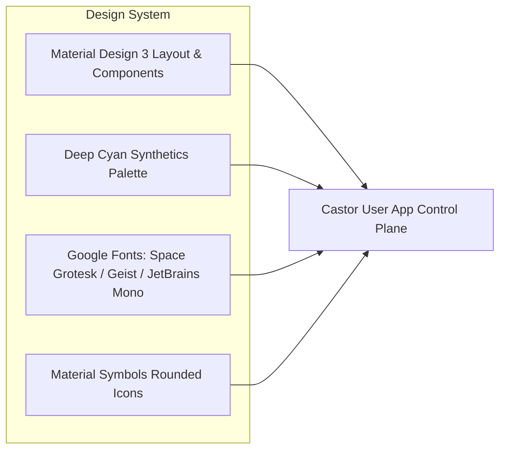
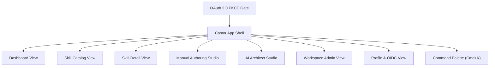

# Castor Web UI & Skill Authoring Studio

The **Castor Web UI** is an enterprise-grade control plane, developer portal, and authoring studio for AI Agent Skills. Built natively with **React 19**, **Vite**, **Tailwind CSS v4**, and hermetically managed via **Bazel 8** and **Aspect Rules JS**, the interface provides full lifecycle management of skills, workspaces, and team access.

---

## 1. Quickstart: Running the Web UI

Castor uses **Aspect Rules JS** (`aspect_rules_js`) and native Bazel modules for JavaScript/TypeScript tooling. You do not need ambient Node.js or shell scripts—everything is orchestrated hermetically by Bazel.

### 1.1 Start the Interactive Development Server

To launch the local Vite development server with Hot Module Replacement (HMR):

```bash
bazel run //:user-app-dev
```

Alternatively, invoke the package target directly:
```bash
bazel run //web/user-app:dev
```

The application will be served locally at:
```text
http://localhost:5173
```

### 1.2 Build Production Assets Hermetically

To run type checking and produce the optimized production bundle inside the Bazel sandbox:

```bash
bazel build //:user-app
```

The compiled static assets (`index.html`, CSS, JS bundles) will be emitted directly into:
```text
bazel-bin/web/user-app/dist
```

### 1.3 Hermetic Package Management (`pnpm`)

To execute `pnpm` operations without installing `pnpm` on your host machine:

```bash
# Run type checking and bundle build directly
bazel run pnpm -- --dir web/user-app run build

# Add a dependency
bazel run pnpm -- --dir web/user-app add <package-name>
```

---

## 2. Design System: Deep Cyan Synthetics & Material Design 3

The user interface implements the **Material Design 3 (M3)** specification paired with the **Deep Cyan Synthetics** dark glassmorphism aesthetic.



### 2.1 Theme & Color Palette

| Token | Hex / Value | Semantic Role |
| :--- | :--- | :--- |
| `--color-primary` | `#00f2fe` | High-contrast electric cyan for primary actions and focus states |
| `--color-primary-container` | `rgba(0, 242, 254, 0.12)` | Subtle glassmorphic container background |
| `--color-surface` | `#0a0e17` | Canvas root dark background |
| `--color-surface-container` | `#0f172a` | Elevated dark glass cards and modal bodies |
| `--color-surface-container-high` | `#162032` | Secondary sidebars, top bars, and table headers |
| `--color-border-subtle` | `rgba(0, 242, 254, 0.18)` | Luminescent cyan borders for card definition |
| `--color-text-primary` | `#f8fafc` | High-emphasis body text and headings |
| `--color-text-secondary` | `#94a3b8` | Medium-emphasis descriptions and metadata |

### 2.2 Typography & Iconography
- **Display & Headings**: `Space Grotesk` (weights 500, 600, 700) for futuristic, clean headers.
- **Body & Interface**: `Geist` (weights 400, 500, 600) for maximum UI readability.
- **Code & Manifests**: `JetBrains Mono` for JSON schemas, YAML frontmatter, and code synthesis.
- **Icons**: `Material Symbols Rounded` rendered with dynamic font variation settings (`'wght' 400, 'opsz' 20..48, 'FILL' 0/1`).

---

## 3. Interactive UI Walkthrough

The Castor UI is structured into specialized views accessible through the persistent **Navigation Rail** and the **Global Command Palette**.



### 3.1 OAuth 2.0 PKCE Authentication Gate

To comply with enterprise security requirements, all access to the Castor UI is guarded by an OAuth 2.0 PKCE login gate.

- **Enterprise Single Sign-On (SSO)**: Supports Google Workspace, Microsoft Entra ID, Okta, and GitHub Enterprise.
- **Corporate Domain Validation**: The client enforces email domain validation during callback token verification. Public freemail addresses (`@gmail.com`, `@yahoo.com`, `@hotmail.com`) are rejected with an explicit security alert banner.
- **Session State**: Valid OIDC claims (`sub`, `email`, `hd`, `roles`) and PKCE state are stored in browser session storage and managed by `AuthContext`.

### 3.2 Global Command Palette (`Cmd+K` / `Ctrl+K`)

Accessible anywhere in the application by pressing `Cmd+K` (macOS) or `Ctrl+K` (Linux/Windows):
- **Omnibox Search**: Search across skills by title, tags, or description.
- **Workspace Switcher**: Jump instantly to any registered team workspace (`corporate_fare`).
- **Quick Actions**: Launch the AI Architect Copilot, open the Manual Studio, or view audit logs with a single keystroke.

### 3.3 Operations Dashboard

The dashboard provides a high-level operational overview of the active workspace:
- **KPI Metrics**: Active Skills Count, Total Vector Embeddings, Verified 5-Point SDLC Skills, and Active Team Collaborators.
- **Featured Skills**: Quick-launch cards for popular registry skills (e.g., `bigquery-sales-forecaster`, `k8s-pod-diagnostician`).
- **Recent Workspace Activity**: Audit feed of recent skill registrations, scenario runs, and member additions.

### 3.4 Semantic Skill Catalog & Discovery

The Catalog view (`/skills`) provides real-time semantic discovery across registered agent skills:
- **Vector Search**: Real-time debounced query input matching semantic intent.
- **Category Filter Chips**: Filter by `all`, `analytics`, `database`, `devops`, `google-cloud`, `machine-learning`, and `security`.
- **Bounded Pagination**: Strictly enforces pagination limits ($1 \le \text{page\_size} \le 25$) with a responsive pagination bar.
- **Skill Cards**: Displays skill title, version, author attribution, description, category tag, and Human-in-the-Loop (HITL) safety tier badges (`TIER_1_READ_ONLY`, `TIER_2_AUDITED_WRITE`, `TIER_3_MANDATORY_APPROVAL`).

### 3.5 Skill Detail & L3 Asset Tree Explorer

Selecting any skill opens the comprehensive Skill Detail inspection view:
- **Header & Action Bar**: Skill name, SemVer version, download/export manifest options, and "Edit in Studio" shortcut.
- **L3 Asset Tree**: Interactive filesystem tree explorer displaying:
  - `SKILL.md`: Main instructions and operational documentation.
  - `metadata.json`: Strict JSON schema parameters, author attribution, and capabilities.
  - `scripts/`: Executable helper tools and deployment scripts.
  - `scenarios/`: YAML/Markdown test scenario fixtures for automated verification.
- **Tabs**:
  - **Overview**: Formatted markdown rendering of instructions, trigger phrases, and tool contracts.
  - **Raw Frontmatter**: Syntax-highlighted YAML manifest with verified cryptographic SHA-256 hash.
  - **Tool Definitions**: JSON schema parameter inspector for tools exposed to ADK agents.

### 3.6 Manual Skill Authoring Studio

Designed for engineers authoring skills with deterministic quality guarantees:
- **Two-Column Split View**: Left pane contains metadata inputs, category selector, SemVer input, and multi-line markdown instruction editor. Right pane provides a live markdown preview.
- **Live 5-Point SDLC Quality Invariant Linter**: Audits draft changes in real time against enterprise quality rules:
  1. **Semantic Naming**: Must match `^[a-z0-9]+(-[a-z0-9]+)*$` (kebab-case).
  2. **Concrete Instructions**: Minimum 80 characters of actionable operational guidelines.
  3. **Valid SemVer**: Strictly enforces `MAJOR.MINOR.PATCH` syntax.
  4. **Detailed Description**: Minimum 20 characters explaining agent capabilities.
  5. **Category & Attribution**: Non-empty domain category and verifiable author handle.

### 3.7 AI Skill Architect Studio

An autonomous conversational studio powered by the Model Context Protocol (MCP):
- **Conversational Chat Interface**: Send natural language prompts describing desired agent capabilities.
- **Animated MCP Tool Call Tracing**: Watch the agent invoke tools in real time:
  - `search_skills`: Discovers similar existing skills to prevent duplicate work.
  - `get_skill`: Fetches reference implementations for architectural context.
- **Live Token Streaming**: Code and schema specifications stream into the right-hand panel as the agent reasons.
- **Behavioral Scenario Runner**: Run automated scenario simulations against the synthesized skill to verify trigger phrases and tool execution outputs before registration.

### 3.8 Group & Workspace Administration

Enables enterprise team governance:
- **Workspace Switcher**: Select between registered applications and environments (`domain`, `app_id`).
- **Role-Based Access Control (RBAC)**: Manage team members with granular roles:
  - `OWNER`: Full administrative control, API key creation, member invitations.
  - `EDITOR`: Author, edit, and test skills.
  - `VIEWER`: Read-only access to catalog and manifests.
- **Member Invitation Modal**: Invite team members by corporate email and assign initial RBAC roles.
- **Scoped API Keys**: Create and revoke hashed API keys with configurable permissions (`skills:read`, `skills:write`, `scenarios:execute`).

### 3.9 User Profile & OIDC Claims Inspector

Accessible via the user avatar or top navigation:
- **Identity Claims**: View verified user email, corporate domain, role, and department.
- **Security Settings**: Toggle Two-Factor Authentication (2FA) and view active login sessions across devices.
- **Raw OIDC Claims Inspector**: Transparent JSON viewer displaying full cryptographic token claims (`sub`, `iss`, `aud`, `exp`).

### 3.10 HTTP 429 Rate Limit Resilience

When high-throughput vector queries or agent requests encounter HTTP 429 (Too Many Requests), the API client automatically:
1. Detects the `429 Too Many Requests` status code.
2. Executes exponential backoff with randomized jitter (initial 1.5s delay, multiplier 2.0x, max 5 retries).
3. Renders a prominent **Luminescent Amber Alert Banner** at the top of the UI with an animated countdown timer notifying the user of active throttling.

---

## 4. Source Tree & Architecture

The Web UI codebase is organized modularly inside [web/user-app](https://github.com/retail-cortex/castor/blob/main/web/user-app):

```text
web/user-app/
├── BUILD.bazel              # Aspect rules_js vite build & dev targets
├── package.json             # NPM dependencies (React 19, Tailwind v4, Vite)
├── pnpm-lock.yaml           # Fully resolved cryptographic lockfile
├── tsconfig.json            # Strict TypeScript configuration
├── vite.config.ts           # Vite bundler configuration with @tailwindcss/vite
├── index.html               # Entry HTML with M3 font links
└── src/
    ├── main.tsx             # Application bootstrap & Context provider tree
    ├── App.tsx              # Shell layout, navigation rail, view router
    ├── index.css            # Tailwind CSS v4 custom theme tokens & glassmorphism
    ├── types/               # TypeScript domain interfaces
    │   ├── auth.ts          # OAuth 2.0 & OIDC claims
    │   ├── security.ts      # Audit logs & invariant types
    │   ├── user.ts          # User profile & session types
    │   ├── workspace.ts     # Workspaces, members, and API keys
    │   ├── skill.ts         # Skill definitions, drafts & SDLC checks
    │   └── agent.ts         # MCP tool calls & chat messages
    ├── contexts/            # URI & Domain React Contexts
    │   ├── AuthContext.tsx         # OAuth PKCE & domain gating
    │   ├── SecurityContext.tsx     # Enterprise audit logging
    │   ├── ProfileContext.tsx      # User profile & preferences
    │   ├── WorkspaceContext.tsx    # Workspaces & team RBAC
    │   ├── SkillCatalogContext.tsx # Semantic search & pagination
    │   ├── SkillEditContext.tsx    # Manual editing & 5-point linter
    │   ├── AgentContext.tsx        # AI Architect MCP chat session
    │   └── ToastContext.tsx        # Notifications & 429 backoff banner
    ├── services/            # Backend REST & MCP API clients
    │   ├── apiClient.ts            # Fetch wrapper with 429 retry logic
    │   ├── authService.ts          # PKCE token exchange
    │   ├── skillService.ts         # Catalog & draft persistence
    │   ├── workspaceService.ts     # Teams & API keys
    │   └── mcpAgentService.ts      # MCP tool streaming mock/live client
    └── components/          # Reusable UI component library
        ├── common/          # GlassCard, GlassButton, Icon, Modal, StatusBadge
        ├── navigation/      # TopAppBar, NavigationRail, CommandPalette
        ├── auth/            # OAuthLoginModal
        ├── profile/         # ProfileManager
        ├── workspaces/      # WorkspaceAdmin
        ├── skills/          # SkillCard, SkillCatalog, SkillDetail, PaginationBar
        ├── studio/          # ManualStudio (5-point linter)
        ├── agent/           # AgentStudio (MCP copilot)
        └── dashboard/       # Dashboard KPI overview
```

---

## 5. Bazel Rules Integration Reference

The Web UI is defined natively in [web/user-app/BUILD.bazel](https://github.com/retail-cortex/castor/blob/main/web/user-app/BUILD.bazel):

```python
load("@aspect_rules_js//js:defs.bzl", "js_binary", "js_run_binary")
load("@npm//:defs.bzl", "npm_link_all_packages")
load("@npm//web/user-app:vite/package_json.bzl", vite_bin = "bin")

package(default_visibility = ["//visibility:public"])

# Links all npm dependencies from pnpm-lock.yaml into Bazel targets
npm_link_all_packages(name = "node_modules")

filegroup(
    name = "srcs",
    srcs = glob([
        "src/**",
        "public/**",
        "index.html",
        "package.json",
        "tsconfig.json",
        "tsconfig.node.json",
        "vite.config.ts",
    ]),
)

# Hermetic production build rule
vite_bin.vite(
    name = "build",
    args = ["build"],
    chdir = package_name(),
    out_dirs = ["dist"],
    srcs = [
        ":node_modules",
        ":srcs",
    ],
)

# Interactive local development server rule
vite_bin.vite_binary(
    name = "dev",
    args = ["--host"],
    chdir = package_name(),
    data = [
        ":node_modules",
        ":srcs",
    ],
)
```

Root build targets in [BUILD.bazel](https://github.com/retail-cortex/castor/blob/main/BUILD.bazel) provide global aliases:
- `bazel run //:user-app-dev`: Launches the dev server.
- `bazel build //:user-app`: Compiles production assets into `bazel-bin/web/user-app/dist`.
- `bazel run //:pnpm`: Hermetic package manager runner.
